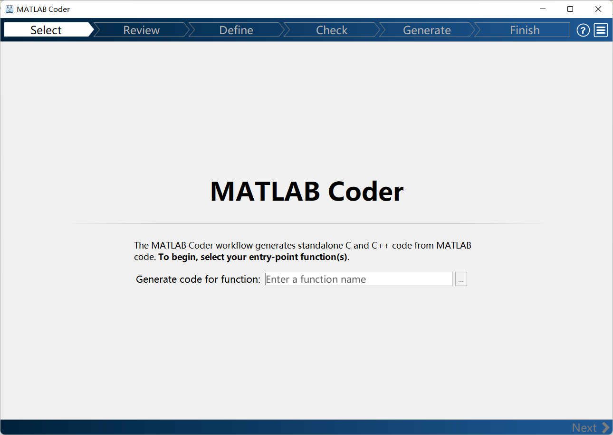
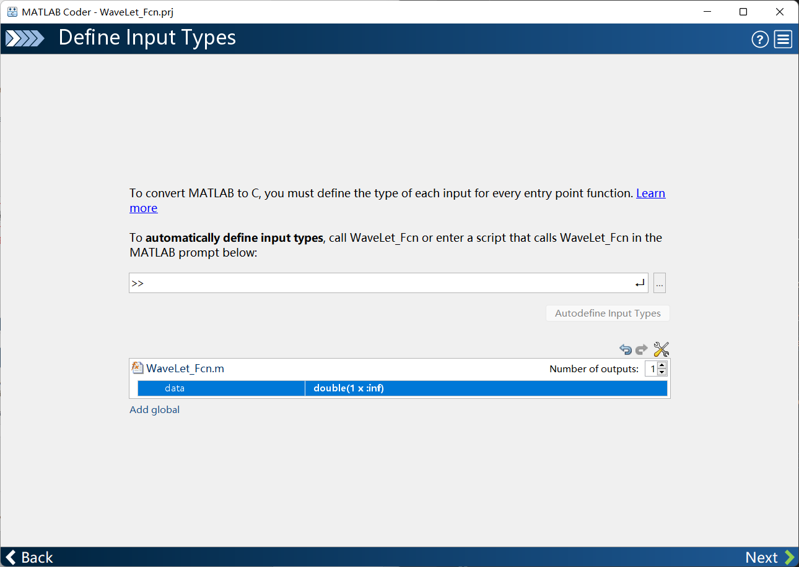
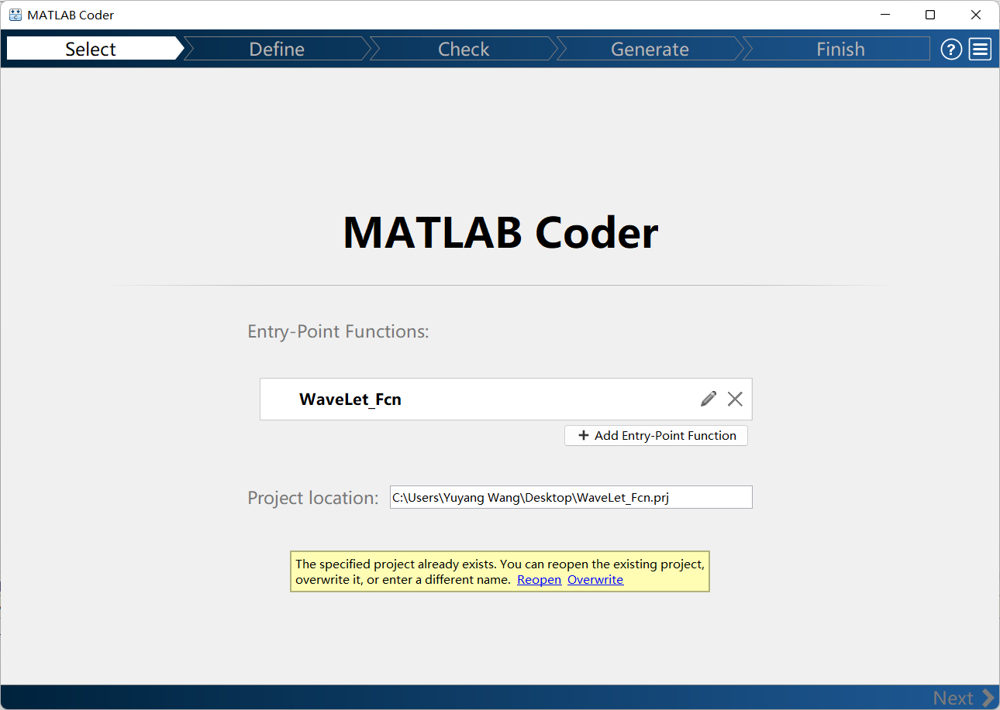
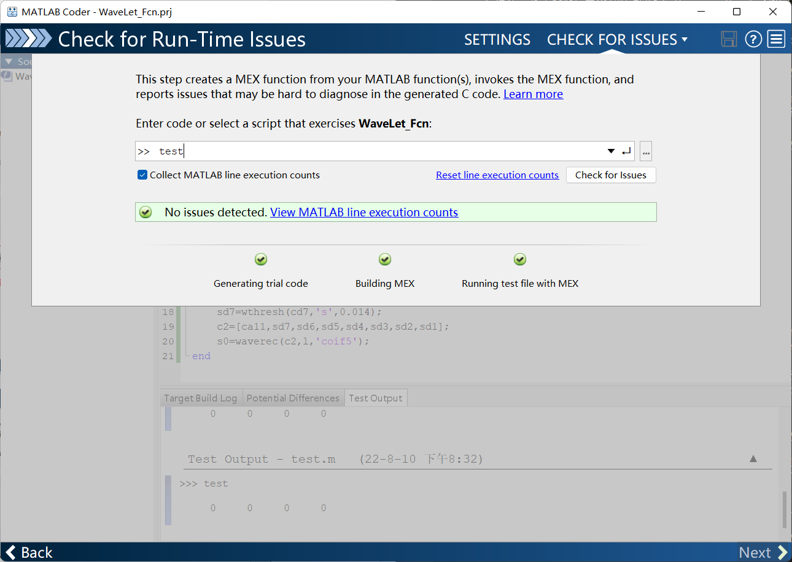
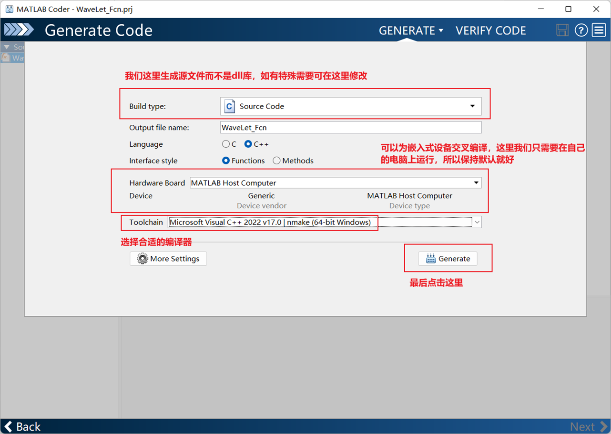
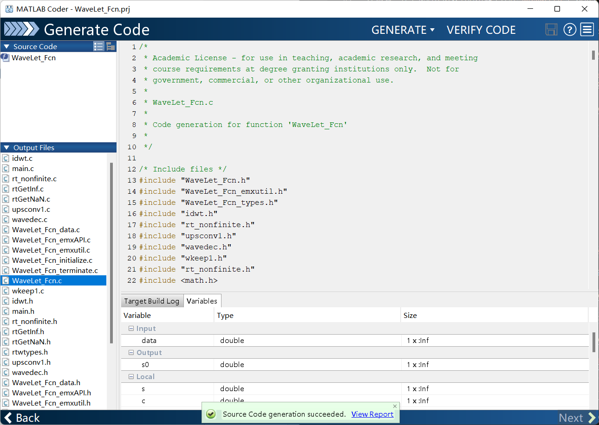

## 准备工作

| Installing Prerequisite Products                |
|-------------------------------------------------|
| MATLAB                                          |
| MATLAB Coder                                    |
| MATLAB ToolBox (e.g. Signal Processing ToolBox) |
| C++ compiler                                    |

MATLAB 及 MATLAB Coder 的安装方法请自行查阅 MATLAB 官方文档。

> 如果 MATLAB 安装在包含非 7 位 ASCII 字符（例如日语字符）的路径中，MATLAB Coder 可能会由于找不到代码生成库函数而无法工作。
>
> — <cite>MathWorks[^1]</cite>

[^1]: The above note is excerpted from MathWorks' [Help Center](https://ww2.mathworks.cn/help/coder/gs/installing-prerequisite-products.html).

不同的MATLAB版本支持的C/C++编译器也不同，详细的支持列表可参考 MATLAB [官方文档][1]，本文将在如下环境中完成所有工作：

* MATLAB 2022a
* Microsoft Visual C++ 2022 v17.0 | nmake (64-bit Windows)

> 注意：Microsoft Visual C++ 2022 is supported as of R2022a.

## 使用 MATLAB Coder 生成 Cpp 源码

本节内容参考 MATLAB 官方文档 [使用 MATLAB Coder App 生成 C 代码][2]。

### 准备待转换的 MATLAB 代码

假定我们已经有了一个利用 MATLAB Wavelet Toolbox 编写的文件`WaveLet_Fcn.m`，该文件包含一个滤波函数`WaveLet_Fcn()`，内容如下：

```MATLAB {linenos=true}
function s0 = WaveLet_Fcn(data) %#codegen
    s=data;
    [c,l]=wavedec(s,7,'coif5');
    ca11=appcoef(c,l,'coif5',7);
    cd1=detcoef(c,l,1);
    cd2=detcoef(c,l,2);
    cd3=detcoef(c,l,3);
    cd4=detcoef(c,l,4);
    cd5=detcoef(c,l,5);
    cd6=detcoef(c,l,6);
    cd7=detcoef(c,l,7);
    sd1=zeros(1,length(cd1));
    sd2=wthresh(cd2,'s',0.014);
    sd3=wthresh(cd3,'s',0.014);
    sd4=wthresh(cd4,'s',0.014);
    sd5=wthresh(cd5,'s',0.014);
    sd6=wthresh(cd6,'s',0.014);
    sd7=wthresh(cd7,'s',0.014);
    c2=[ca11,sd7,sd6,sd5,sd4,sd3,sd2,sd1];
    s0=waverec(c2,l,'coif5');
end
```

该函数具有一个参数`data`和一个返回值`s0`，由于 C++ 是静态类型语言，后面我们将会看到，我们需要手动指定`data`在转换后的实际类型（只需指定函数参数即可，MATLAB 会自动推断返回值类型）。

注意第一行中我们在函数名后增加了注释`%#codegen`，该指令会通知 Coder 检查是否存在可能的错误，如果有错就会用波浪线标识出来，详细内容可参考[官方文档][2]。

> 除非你很清楚自己在做什么，**请在进行后续步骤之前确保所有报错已被修改！**

### 打开 MATLAB Coder 并设置变量类型

在确认没有红色波浪线后，点击 MATLAB 主界面顶端工具栏 “APP—MATLAB Coder” 进入如下图所示的界面：



选择待转换的`.m`文件，点击右下角`Next`，随后点击`Let me enter input or global types directly`，这里要指定函数参数`data`的类型，假设我们希望该变量为`double`类型一维数组，长度可变，故设置为：



### 检查 Run-Time 问题并转换代码

接下来开始选择测试文件，测试文件是一个调用了上述`WaveLet_Fcn()`函数的文件，这里，我们先新建一个`test.m`文件，然后在其中写入以下内容：

```MATLAB
data = [0, 0, 0, 0];

[res] = WaveLet_Fcn(data);

disp(res)
```

`test.m`文件应与`WaveLet_Fcn.m`放置在同一目录下：

```txt
your_project_name/
├── WaveLet_Fcn.m
└── test.m
```

随后回到 MATLAB Coder，在输入框中选中我们刚刚新建的`test.m`文件，然后点击`Check for Issues`。这里如果提示：

```txt
Error evaluating test code. 

原因:
    函数或变量 'test' 无法识别
```

请退出 MATLAB Coder，在 MATLAB 中运行一次`test.m`文件，把`test.m`文件所在目录添加到 MATLAB 路径中，再重新运行 MATLAB Coder，点击`Reopen`，即可正确运行。



如果程序提醒：`No issues detected.`



则直接继续点击`Next`：



按上图调整设置，并点击生成代码。弹出的界面左下角可以看到输出的所有 C++ 文件（`.h`和`.Cpp`）：



这些文件都被放置在`WaveLet_Fcn.m`所在目录的`codegen\lib\WaveLet_Fcn`文件夹下。只需将**所有**`.h`和`.Cpp`复制到 QT Project 或其它项目中编译即可，函数入口就在`WaveLet_Fcn.h`文件中。

```Bash
your_project_name/
├── WaveLet_Fcn.m
├── test.m
└── codegen/
    ├── lib/
    │   └── WaveLet_Fcn/
    │       ├── examples/
    │       │   └── ...
    │       ├── html/
    │       │   └── ...
    │       ├── interface/
    │       │   └── ...
    │       ├── idwt.c
    │       ├── idwt.h
    │       ├── rt_nonfinite.c
    │       ├── rt_nonfinite.h
    │       ├── rtGetInf.c
    │       ├── rtGetInf.h
    │       ├── rtGetNaN.c
    │       ├── rtGetNaN.h
    │       ├── rtwtypes.h
    │       ├── upsconv1.c
    │       ├── upsconv1.h
    │       ├── wavedec.c
    │       ├── wavedec.h
    │       ├── WaveLet_Fcn_data.c
    │       ├── WaveLet_Fcn_data.h
    │       ├── WaveLet_Fcn_emxAPI.c
    │       ├── WaveLet_Fcn_emxAPI.h
    │       ├── WaveLet_Fcn_emxutil.c
    │       ├── WaveLet_Fcn_emxutil.h
    │       ├── WaveLet_Fcn_initialize.c
    │       ├── WaveLet_Fcn_initialize.h
    │       ├── WaveLet_Fcn_terminate.c
    │       ├── WaveLet_Fcn_terminate.h
    │       ├── WaveLet_Fcn_types.h
    │       ├── WaveLet_Fcn.c
    │       ├── WaveLet_Fcn.h
    │       ├── wkeep1.c
    │       └── wkeep1.h
    └── mex/
        └── ...
```

 [1]: https://ww2.mathworks.cn/support/requirements/supported-compilers.html
 [2]: https://ww2.mathworks.cn/help/coder/gs/generating-c-code-from-matlab-code-using-the-matlab-coder-project-interface.html